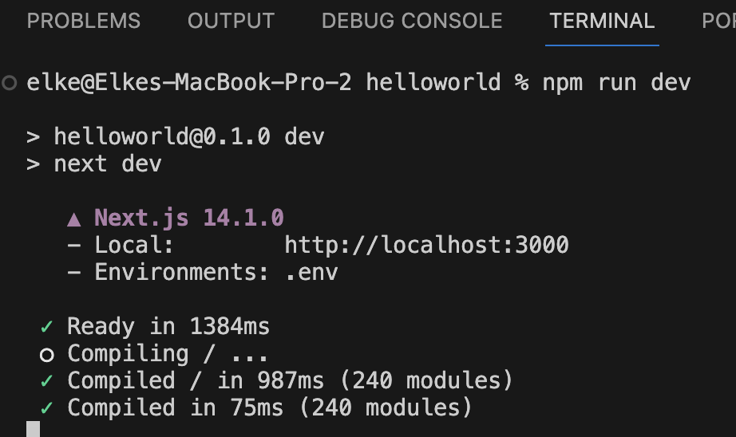

# Create a new Next.js project

## 1. Acceptance Criteria

At the end of this task your repository should contain a minimal, functional Next.js project.

## 2. Implementation Details

1. Navigate in a terminal to the empty repository folder of your frontend on your computer
1. Execute the following command:
    ```console
    npx create-next-app@latest ./ --typescipt --tailwind --no-eslint --no-app --src-dir --import-alias "@/*"
    ```
    This creates a next app in the repository folder with:

    - TypeScript enabled
    - Tailwind enabled
    - No ESLint
    - No AppRouter (you can use `--app` if you prefer to use AppRouter)
    - A `src/` directory for your source files
    - The import alias set to the default (`@/*`)
1. Load the project in your IDE
    * Open a terminal and run the following command
        ```console
        npm install
        ``` 
    * Run in that same terminal the following command
        ```console
        npm run dev
        ```
        The output should be as in the screenshot below

        <a href="./images/expected-output-terminal.png">
            
        </a>
1. Commit to your repository